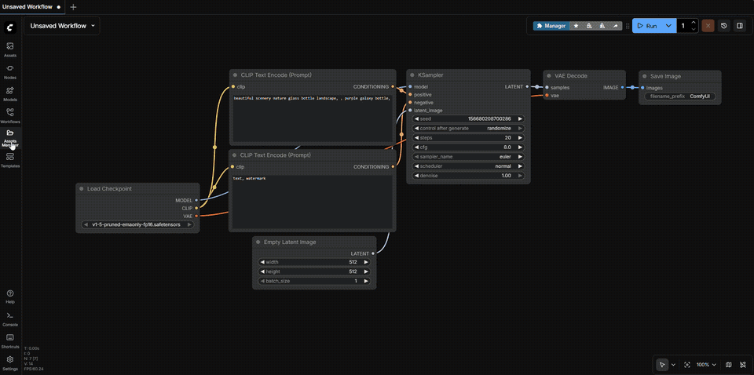
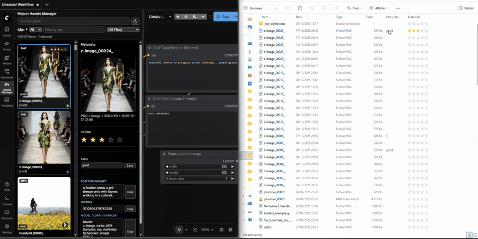
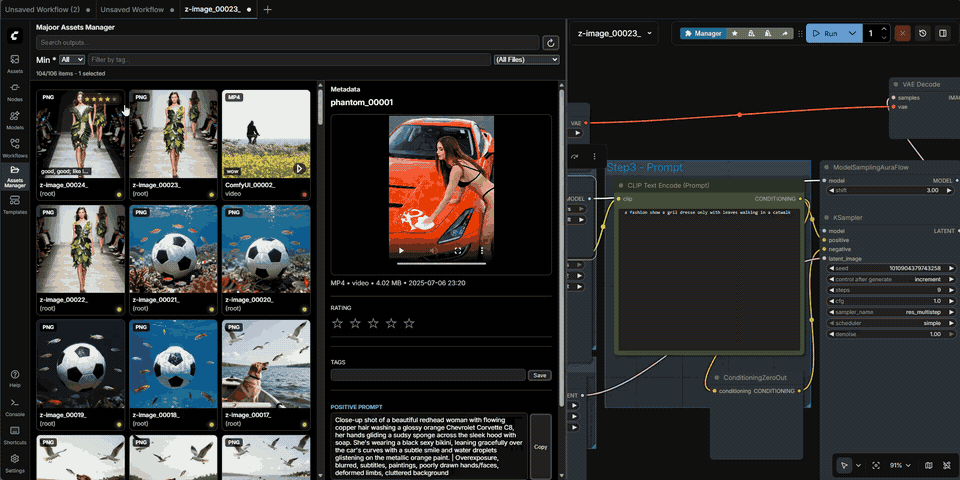
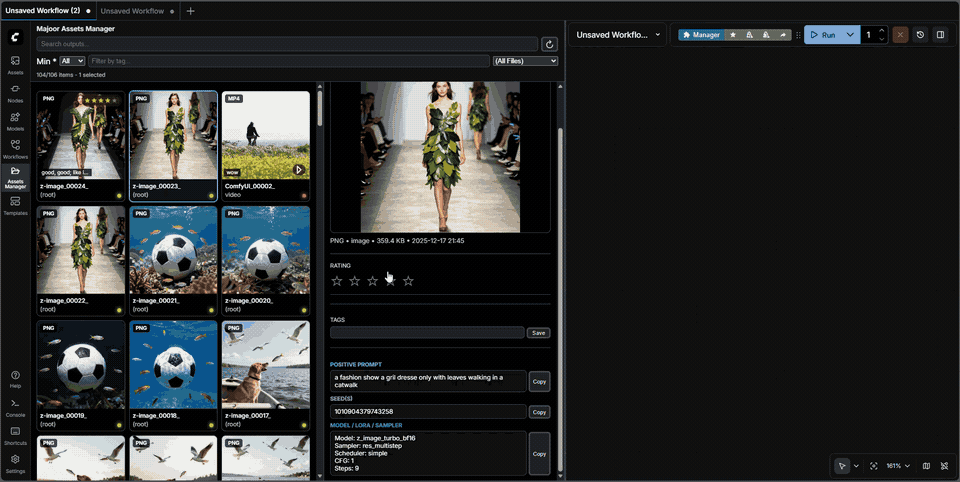
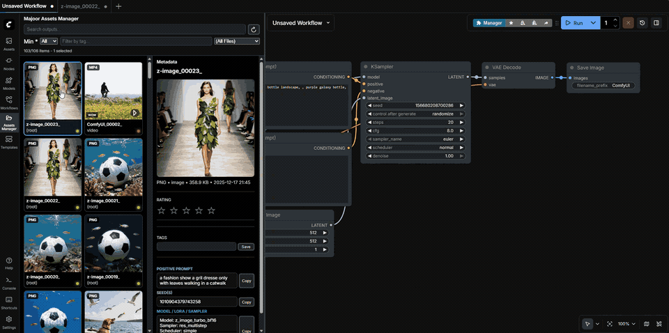

# 📂 Majoor Assets Manager for ComfyUI

Professional asset browser for ComfyUI outputs (images/videos/audio/3D) with **ratings & tags**, **full-text search**, **workflow fingerprinting**, and advanced metadata management.

---

## 🚀 Key Features

### 🔍 **Search & Discovery**
- **Full-text search** powered by SQLite FTS5 with BM25 ranking
- **Workflow fingerprinting**: find all assets generated with the same workflow
- **Smart filters**: Today, Yesterday, Last 7 Days, 5 Stars, 4+ Stars, Videos, Images
- **Advanced filtering**: by rating, tags (AND/OR logic), file type, workflow presence
- **Collections system**: save and organize filtered asset groups in `_mjr_collections`

### ⭐ **Ratings & Tags**
- Set ratings `0–5` on individual or bulk-selected assets
- Add custom tags with instant metadata updates
- Metadata stored in OS-native formats (Windows Property System, XMP) with optional `.mjr.json` sidecars
- Visual badges on cards and in viewer
- Bulk operations bar for multi-file rating/tagging

### ⚡ **Performance**
- **Virtualized grid** with lazy loading (handles thousands of assets)
- Paginated file listing (configurable page size, default 500)
- **Incremental indexing**: only re-scans changed files based on mtime
- LRU cache for thumbnails (200 items)
- Debounced search (300ms) and optimistic UI updates
- Optional auto-refresh with focus-aware polling

### 🧠 **Metadata Intelligence**
- **Prompt/workflow inspector**: extracts generation parameters from PNG, video, and EXIF UserComment
- **Workflow tracer v2**: recursive node graph reconstruction for ComfyUI workflows
- **Lossless PNG metadata injection**: preserves workflow JSON when writing ratings/tags
- Native EXIF parser with multi-encoding support (UTF-8, UTF-16, Latin-1)
- **Hybrid metadata mode**: tries advanced parsers first, falls back to legacy methods
- Reads model, sampler, steps, CFG, seed, LoRA, and custom node parameters

### 🖼️ **Viewer & A/B Compare**
- **Single viewer**: full-screen zoom/pan, video playback, rating HUD
- **A/B compare mode**: side-by-side comparison with synchronized controls
- **Frame-by-frame navigation** for videos (±1/30s step)
- Keyboard-driven navigation (`ArrowUp`/`Down` for prev/next, `0-5` for rating)
- Optional checkerboard background for transparency
- Autoplay, loop, and mute controls

### ⌨️ **Keyboard-First Workflow**
- `0`-`5`: set rating for selected files
- `Space`: open viewer (1 selected) or A/B compare (2 selected)
- `Ctrl/Cmd+A`: select all filtered files
- Explorer-like selection: `Ctrl`/`Shift` + Click for toggle/range
- Viewer hotkeys: `Esc`, `ArrowUp`/`Down`, `ArrowLeft`/`Right`, `F` (fit/reset)

### 🎨 **UI & Integration**
- **Flexible panel placement**: sidebar, bottom panel, or both
- Hover tooltips with file metadata (filename, folder, size, date, rating, tags, workflow state)
- Real-time index status indicator (green/yellow/red/gray dot)
- Workflow state badge on cards (green: full data, yellow: partial, red: corrupt, gray: none)
- Drag-and-drop support for files into ComfyUI canvas
- Context menu for quick actions (delete, open in explorer, stage to input)

---

## 📦 Installation

### Method 1: ComfyUI Manager (recommended)

1. Open ComfyUI Manager
2. Search for "Majoor Assets Manager" or install via Git URL
3. Install and restart ComfyUI

### Method 2: Manual

```bash
cd ComfyUI/custom_nodes
git clone <this-repo-url> ComfyUI-Majoor-AssetsManager
pip install -r ComfyUI-Majoor-AssetsManager/requirements.txt
```

Restart ComfyUI.

---

## ✅ Requirements

Python dependencies (auto-installed by ComfyUI Manager):

- `aiohttp` (REST API server)
- `pillow` (thumbnail generation)
- `send2trash` (safe delete to recycle bin)
- `pywin32` (Windows only; enables Windows Property System metadata)

**Strongly recommended** external tools:

- 🧰 **ExifTool** (video metadata read/write, XMP/IPTC support)
  - Windows: download from [exiftool.org](https://exiftool.org) and add `exiftool.exe` to `PATH`
  - macOS: `brew install exiftool`
  - Linux (Debian/Ubuntu): `sudo apt install libimage-exiftool-perl`
- 🎬 **ffprobe** (improved video metadata extraction; usually bundled with FFmpeg)

---

## 🎞️ Demos (GIF)

Click to view full demos (GIFs are large and not embedded):

- ⚡ **Fast browsing**
  
- ⭐ **Ratings & 🏷️ tags**
  
- 🗂️ **Smart collections**
  
- 🧩 **Drag & drop workflow**
  
- 🎞️ **Frame-by-frame (video)**
  
- 🧩 **UI rendering/integration**
  

## 🎬 Metadata Storage & Video Reliability

### Metadata Storage Strategies

- **Windows**: OS metadata via Property Store (default) + optional `.mjr.json` sidecars
- **macOS/Linux**: `.mjr.json` sidecar files (default) + ExifTool XMP when available
- **Configurable**: Set `MJR_ENABLE_SIDECAR=1` or `MJR_FORCE_SIDECAR=1` environment variables

### Video Metadata Redundancy

Windows Explorer and media players can be inconsistent with MP4/MOV/MKV/WEBM metadata. The manager uses a **redundant write strategy**:

- ✅ **Always writes**:
  - `XMP:Rating` (0–5 stars, industry standard)
  - `XMP:Subject` (tags list with `; ` separator)

- ✅ **Best-effort writes** (does not fail if unsupported):
  - `Microsoft:SharedUserRating` (0–99 "percent" scale for Windows Explorer)
  - `Microsoft:Category` (tags formatted for Explorer: `tag1; tag2`)

- 🛡️ **Workflow preservation**: Copies original metadata fields (`-tagsFromFile @ ...`) before writing, preserving embedded ComfyUI workflow JSON in comment-like fields

- ⏳ **Retry mechanism**: Handles "file not ready/locked" errors right after generation with exponential backoff (up to 5 retries)

- 📥 **Read priority**: ExifTool values (XMP > Microsoft) → Windows Property System → sidecar fallback

---

## ⌨️ Keyboard Shortcuts

**Note**: Hotkeys are ignored while typing in input fields or textareas.

### Grid View (Asset Browser)

| Key | Action |
|-----|--------|
| `0`–`5` | Set rating for selected files (`0` clears rating) |
| `Space` | Open viewer (1 selected) or A/B compare (2 selected) |
| `Ctrl`/`Cmd` + `A` | Select all filtered files |
| `Click` | Clear selection + select item |
| `Ctrl`/`Cmd` + `Click` | Toggle item selection |
| `Shift` + `Click` | Select range from last anchor |
| `Ctrl`/`Cmd` + `Shift` + `Click` | Add range to selection |

### Viewer Mode

| Key | Action | Requires Setting |
|-----|--------|------------------|
| `Esc` or `Space` | Close viewer | - |
| `ArrowUp` / `ArrowDown` | Previous/next asset | Navigation enabled |
| `0`–`5` (incl. numpad) | Set rating | Rating hotkeys enabled |
| `ArrowLeft` / `ArrowRight` | Step video ±1/30s | Frame-step hotkeys enabled |
| `F` | Fit/reset zoom | - |

---

## ⚙️ Settings (ComfyUI → Settings)

Access settings via the ComfyUI settings panel (gear icon).

### Panel & Display

- 🧩 **Panel Integration** (requires reload): `sidebar`, `bottom`, or `both` (default)
- 📄 **Page Size**: files per request (default: `500`)
- 🎴 **Card Size**: compact, medium, or large grid cards
- 🛈 **Hover Info Tooltips**: show/hide metadata tooltips on card hover
- 🏷️ **Show Tags on Cards**: display tag badges
- ⭐ **Show Ratings on Cards**: display rating badges

### Auto-Refresh

- 🔁 **Enable Auto-refresh**: automatically poll for new assets
- ⏱️ **Refresh Interval**: polling frequency in milliseconds (default: `5000`)
- 🔍 **Focus-Only Mode**: only refresh when ComfyUI window is active

### Viewer Settings

- ▶️ **Autoplay Videos**: start playback automatically
- 🔁 **Loop Videos**: repeat video playback
- 🔇 **Mute Videos**: disable audio by default
- ◀️▶️ **Show Navigation**: display prev/next arrows
- ⭐ **Show Rating HUD**: display rating overlay in viewer
- ⌨️ **Rating Hotkeys**: enable `0`-`5` keys in viewer
- ⌨️ **Frame-Step Hotkeys**: enable `ArrowLeft`/`Right` for video stepping
- 🎨 **Checkerboard Background**: show transparency pattern

---

## 🧩 Advanced Configuration

### Environment Variables

#### Metadata Mode & Parsers
- `MJR_METADATA_MODE` - `legacy` | `hybrid` (default) | `native`
- `MJR_METADATA_EXIF_NATIVE` - Enable native EXIF UserComment decoder (default: `1`)
- `MJR_COMFY_TRACE_V2` - Enable recursive workflow node tracer v2 (default: `1`)
- `MJR_METADATA_PNG_INJECT` - Enable lossless PNG metadata injection (default: `1`)
- `MJR_METADATA_WORKFLOW_HASH` - Enable workflow fingerprinting (default: `1`)

#### Sidecar Configuration
- `MJR_ENABLE_SIDECAR` - Enable `.mjr.json` sidecar files (default: `1` on non-Windows)
- `MJR_FORCE_SIDECAR` - Force sidecar-only mode (ignores OS metadata)

#### Timeouts (milliseconds)
- `MJR_META_EXIFTOOL_TIMEOUT` - ExifTool metadata extraction timeout
- `MJR_META_FFPROBE_TIMEOUT` - ffprobe extraction timeout
- `MJR_EXIFTOOL_READ_TIMEOUT` - ExifTool read operation timeout
- `MJR_EXIFTOOL_WRITE_TIMEOUT` - ExifTool write operation timeout
- `MJR_EXIFTOOL_PRESERVE_TIMEOUT` - Workflow preservation timeout
- `MJR_FILE_MANAGER_TIMEOUT` - General file manager timeout

#### Debug Options
- `MJR_DEBUG_METADATA` - Enable verbose metadata logging (default: `0`)
- `MJR_METADATA_SAFE_FALLBACK` - Fallback to legacy on parser errors (default: `1`)

### API Endpoints

All endpoints are prefixed with `/mjr/filemanager/` or `/mjr/collections/`.

#### File Operations
- `GET /mjr/filemanager/files` - List assets (pagination, filtering, sorting)
- `POST /mjr/filemanager/delete` - Safe delete to recycle bin
- `POST /mjr/filemanager/stage_to_input` - Copy files to ComfyUI input
- `POST /mjr/filemanager/batch_zip` - Create batch download ZIP
- `GET /mjr/filemanager/batch_zip/{token}` - Download prepared ZIP
- `POST /mjr/filemanager/open_explorer` - Open file location in system explorer
- `POST /mjr/filemanager/open_folder` - Open folder in explorer

#### Metadata Operations
- `GET /mjr/filemanager/metadata` - Get single file metadata
- `POST /mjr/filemanager/metadata/update` - Update single file metadata
- `POST /mjr/filemanager/metadata/batch` - Get metadata for multiple files
- `POST /mjr/filemanager/metadata/batch_update` - Update multiple files
- `POST /mjr/filemanager/generation/update` - Update generation sidecar
- `POST /mjr/filemanager/sidecar/update` - Update metadata sidecar
- `GET /mjr/filemanager/capabilities` - Check ExifTool/ffprobe availability

#### Search & Indexing
- `GET /mjr/filemanager/index/status` - Real-time index status (FTS5, last scan)
- `GET /mjr/filemanager/index/query` - Full-text search with filters
- `POST /mjr/filemanager/index/reindex` - Trigger incremental/full reindex
- `POST /mjr/filemanager/index/sync_from_metadata` - Sync metadata to index
- `GET /mjr/filemanager/workflow/hash_info` - Workflow hash algorithm details

#### Collections
- `GET /mjr/collections/list` - List all collections
- `GET /mjr/collections/{name}` - Get collection contents
- `POST /mjr/collections/add` - Add files to collection
- `POST /mjr/collections/remove` - Remove files from collection
- `POST /mjr/collections/health_check` - Verify collection integrity

---

## 📝 Notes & Tips

- **Collections folder**: Smart filters and saved collections are stored in `_mjr_collections` inside your ComfyUI output directory
- **Workflow fingerprinting**: Uses SHA1 of canonicalized workflow JSON (excludes node IDs, positions, UI properties) for stable matching across workflow variations
- **Index freshness**: The SQLite FTS5 index auto-detects staleness based on file modification times and triggers incremental reindexing
- **Supported file types**:
  - Images: `.png`, `.jpg`, `.jpeg`, `.webp`, `.gif`
  - Videos: `.mp4`, `.mov`, `.webm`, `.mkv`
  - Audio: `.wav`, `.mp3`, `.flac`, `.ogg`, `.m4a`, `.aac`
  - 3D Models: `.obj`, `.fbx`, `.glb`, `.gltf`, `.stl`
- **Bulk operations**: When selecting 100+ files, a progress modal appears with real-time updates and cancellation support
- **Connection handling**: Gracefully handles HTTP 499 (client closed request) and JSON serialization edge cases (NaN/Infinity)
- **Progressive enhancement**: Full-text search gracefully falls back to LIKE queries if FTS5 is unavailable
